# AI-Based Diabetes Diagnosis System

## Overview
This project develops an end-to-end AI system for diabetes diagnosis using machine learning and large language models (LLMs). The solution integrates predictive modeling with conversational AI for comprehensive patient assessment.


##  Data Processing
### Initial Dataset
- **5,000 patient records** with diabetic/non-diabetic classification
- Significant class imbalance: 
  - Non-diabetic (0): ~4,500 cases 
  - Diabetic (1): ~500 cases
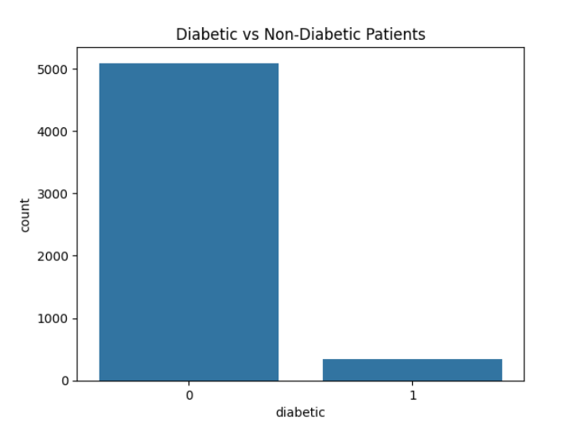
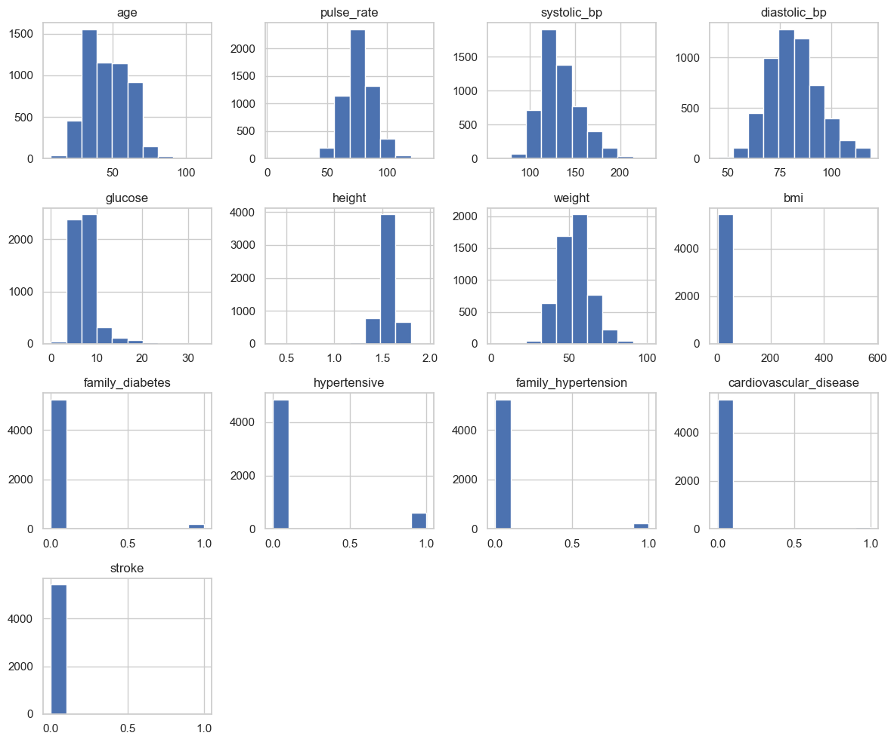
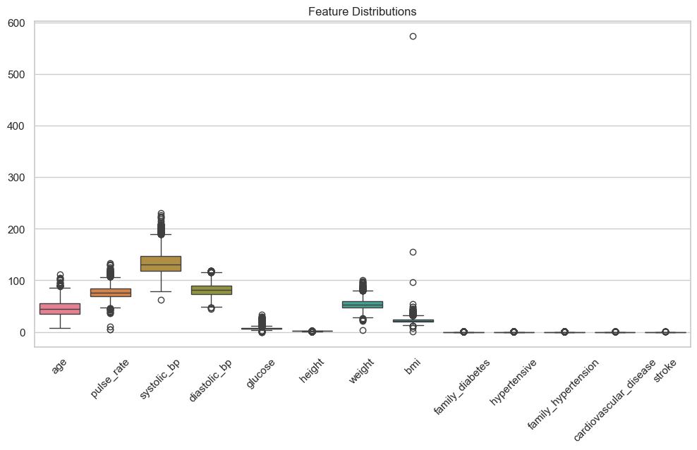
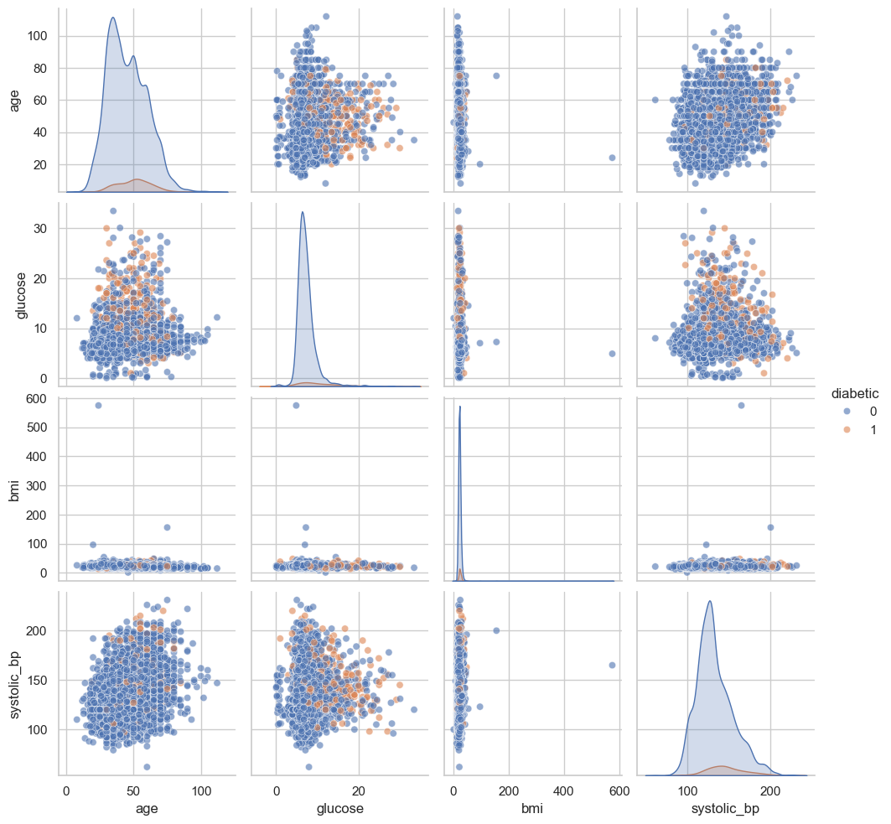
### Preprocessing Steps
1. Removed invalid/zero values from critical features
2. Eliminated physiologically impossible values
3. Applied **SMOTENC** for class balancing:
   - Handles mixed data types (numerical + categorical)
   - Generates synthetic minority class samples
   - Preserves feature relationships

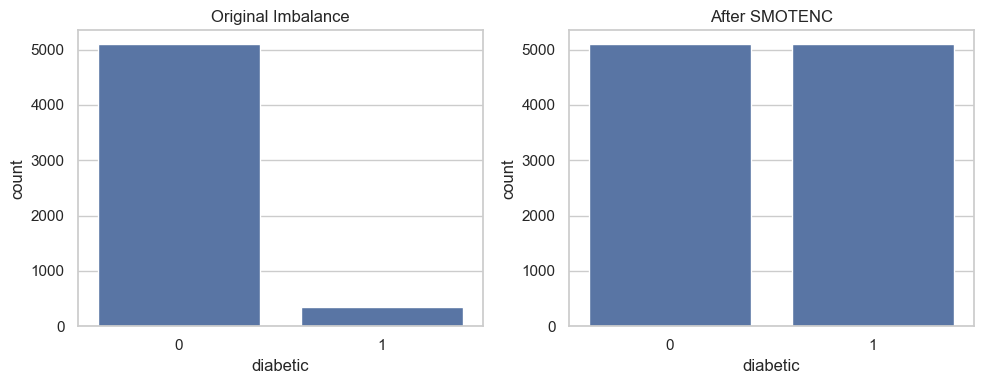
*Class balance before (left) and after (right) SMOTENC application*

## Model Development
### Algorithms Tested
1. Logistic Regression
2. Random Forest
3. XGBoost
4. LightGBM
5. Neural Network (2-layer)

### Training Approach
- Hyperparameter tuning via GridSearchCV/Optuna
- 5-fold cross validation
- ROC AUC as primary metric

```python
# Hyperparameter Tuning Example
param_grid = {
    'max_depth': [3, 5],
    'learning_rate': [0.01, 0.1]
}
model = GridSearchCV(XGBClassifier(), param_grid, cv=5, scoring='roc_auc')
model.fit(X_train, y_train)
```

## Performance Results
### Model Comparison
| Metric          | XGBoost | LightGBM | Random Forest | Logistic Reg | Neural Net |
|-----------------|---------|----------|---------------|--------------|------------|
| **Accuracy**    | 95.97%  | 94.2%    | 93.5%         | 89.8%        | 91.3%      |
| **ROC AUC**     | 0.982   | 0.974    | 0.968         | 0.932        | 0.947      |
| **F1-Score**    | 0.927   | 0.914    | 0.901         | 0.856        | 0.879      |


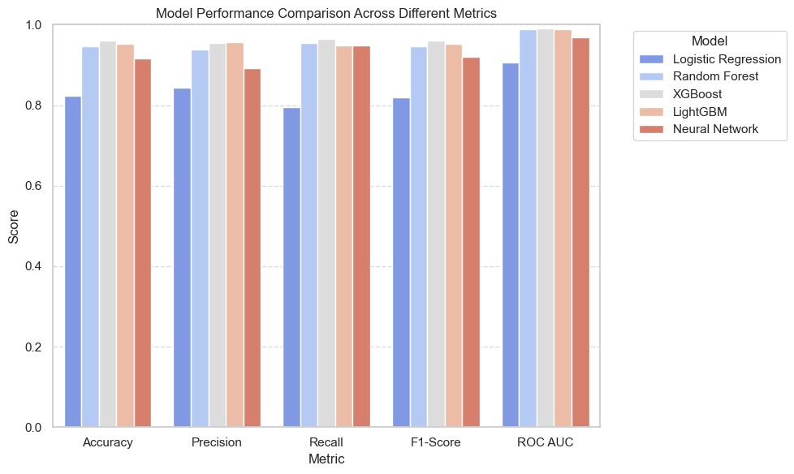
**XGBoost achieved highest accuracy (95.97%)**

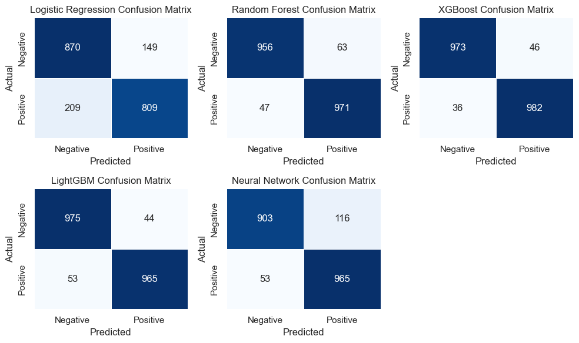

### Neural Network Training
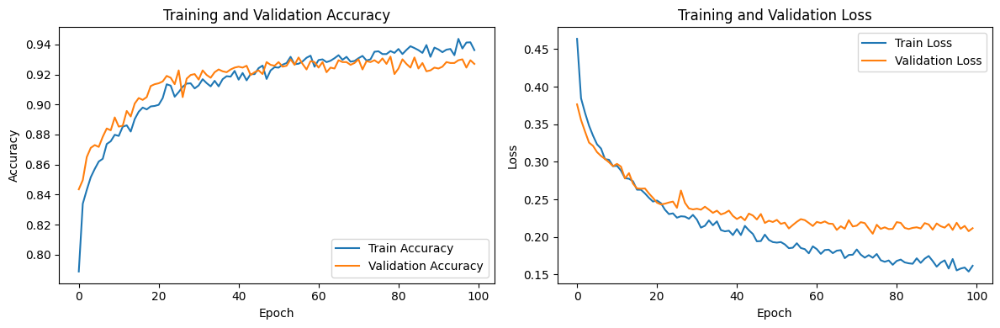
*Optimal parameters: 64 nodes, 0.2 dropout, 0.005 learning rate, 128 batch size*

##  AI Diagnostic Agent
### Dual-Agent Architecture
1. **Conversational Agent (LLM-Based):**
   - Uses LLaMA 3.2 with medical prompt engineering
   - Conducts symptom-based interview
   - Triggers prediction API when confidence >25%
   
   ```
   "Hello! I'm here to ask questions about potential diabetes symptoms.
   Do you experience excessive thirst even after drinking water?"
   ```
   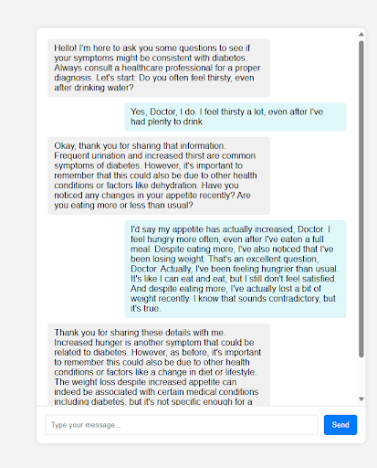

2. **Prediction Agent:**
   - Processes 15+ clinical features:
     * Demographics (age, gender)
     * Vital signs (BP, glucose, BMI)
     * Medical history (hypertension, stroke)
     * Family history

### Prediction Interface
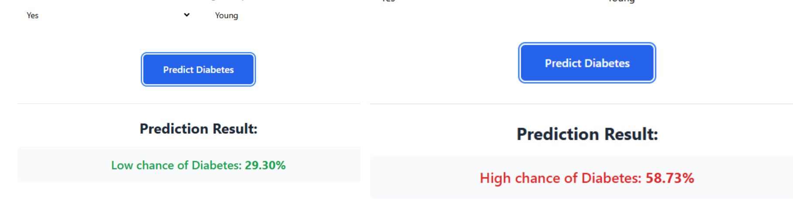
*Clinical input form with real-time risk assessment*

**Sample Output:**  
"Low chance: 29.30% │ High chance: 58.73%"

##  Explainable AI (XAI)
### Interpretation Techniques
1. **Global Explanations:**
   - SHAP summary plots
   - Feature importance rankings
   
2. **Local Explanations:**
   - LIME for individual predictions
   - Interactive prediction breakdowns

```python
# SHAP Implementation
explainer = shap.TreeExplainer(model.best_estimator_)
shap_values = explainer.shap_values(X_test)
shap.summary_plot(shap_values, X_test)
```

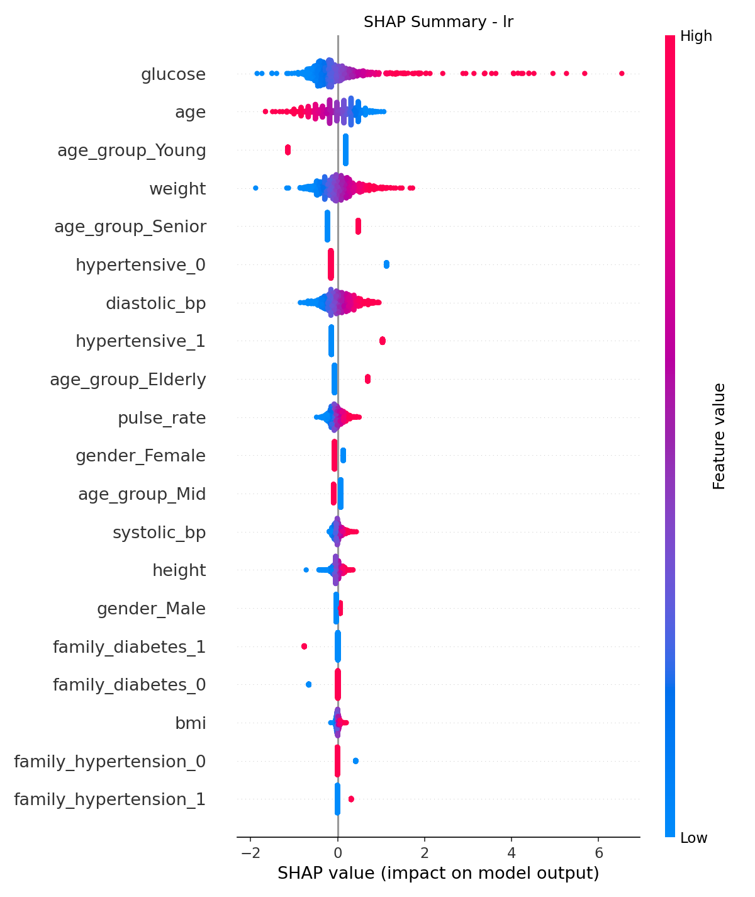
*Glucose levels and age identified as top predictors*

## System Architecture
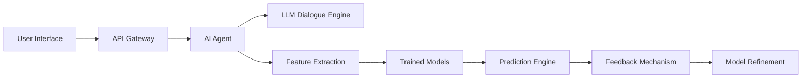

##  Conclusion
This system demonstrates:
- 95.97% prediction accuracy using XGBoost
- Effective class imbalance handling via SMOTENC
- Seamless integration of conversational AI with predictive analytics
- Transparent decision-making through XAI techniques
- Potential for deployment in clinical support systems


